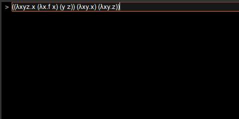

LambdaJS
========

LambdaJS is an interpreter of Lambda calculus written in JavaScript. It accepts terms of Lambda calculus written in JavaScript syntax.

Supported browsers and known issues
-----------------------------------

The latest version of Google Chrome or Firefox is recommended.

It should work on IE, Safari and Opera but less tested on these browsers.
There were some minor issues on old versions of IE and Opera.

Features
--------

- Written in JavaScript and no need for server-side execution
- Visualizes reduction steps
- Allows users to choose evaluation strategy
- Accepts syntax of Lambda calculus, JavaScript or mixture of both

Key bindings on the console
---------------------------

|Key                     |Action          |
|:-----------------------|:---------------|
|`Enter`                 |run             |
|`Ctrl`+`L`              |clear the screen|
|`Ctrl`+`P`, `Up arrow`  |previous input  |
|`Ctrl`+`N`, `Down arrow`|next input      |
|`\`                     |input '&lambda';|

Running example
---------------

See https://tarao.github.io/LambdaJS .
